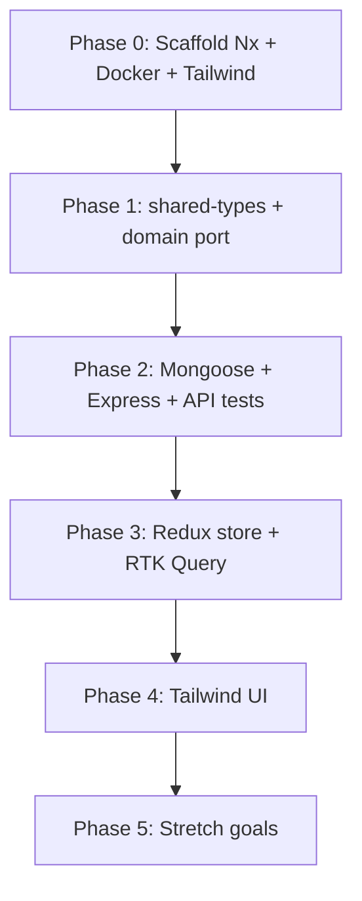

# Event Registration Platform — Tutorial Plan

> **Goal:** Rebuild the in-memory `EventSystem` from [`.cursor/refer/event-system.ts`](./refer/event-system.ts) as a full-stack app inside an **Nx monorepo**, using **React**, **Redux Toolkit + RTK Query**, **Tailwind CSS**, **Express**, and **MongoDB (Mongoose)**.
>
> **Source of truth for business rules:** [`.cursor/refer/event-system.ts`](./refer/event-system.ts) and [`.cursor/refer/event-system.test.ts`](./refer/event-system.test.ts). When in doubt, match the reference — not this document.
>
> **Specification:** [`.cursor/spec.md`](./spec.md)

---

## What you will learn

| Area | Skills |
|------|--------|
| **Nx** | Generate apps/libs, share types, run affected tests, wire project graph |
| **React** | Container/presentational split, forms, optimistic UI patterns |
| **Redux** | Slices, selectors, normalized state, devtools |
| **RTK Query** | API slices, cache tags, invalidation, loading/error states |
| **Express** | REST routing, validation middleware, error mapping |
| **MongoDB** | Schemas, indexes, transactions where needed |
| **Mongoose** | Model definitions, queries, seed scripts |
| **Tailwind** | Layout, responsive admin dashboard, accessible forms |

---

## Domain overview

Before writing any code, read the reference implementation end-to-end.

### Return codes (every mutating operation)

| Code | Meaning | HTTP (recommended) |
|------|---------|-------------------|
| `1` | Success | `200` / `201` |
| `0` | Waitlisted (registration only) | `200` |
| `-1` | Validation / not found / business rule failure | `400` or `404` |

All API responses should include `{ result: 1 | 0 | -1, data?: T, error?: string }` so frontend logic mirrors the kata tests.

### Core entities

```ts
type Skill = "BEGINNER" | "INTERMEDIATE" | "ADVANCED";
type EventType = "WORKSHOP" | "WEBINAR" | "CONFERENCE";
```

| Entity | Key fields | Notes |
|--------|------------|-------|
| **Event** | `id`, `type`, `capacity`, `skill?`, `participantIds[]` | WORKSHOP requires `skill`; waitlist is FIFO per event |
| **Participant** | `id`, `email`, `skill?` | Unique email (tutorial extension) |
| **WaitlistEntry** | `eventId`, `participantId`, `createdAt` | Order by `createdAt` ascending |

### Business rules cheat sheet

**`addEvent(type, capacity, skill?)`**
- Invalid type, `capacity <= 0`, or failed skill validation → `-1`
- WORKSHOP without valid skill → `-1`
- WEBINAR / CONFERENCE without skill → `1`
- Optional valid skill on non-WORKSHOP → `1` (reference allows it if `validateSkill` passes)

**`addParticipant(email, skill?)`**
- Missing email or invalid skill → `-1`
- Otherwise → `1`

**`registerParticipant(participantId, eventId)`**
- Unknown event/participant, duplicate register, already on waitlist → `-1`
- CONFERENCE: email must contain `@business.org` or `@company.com`
- WORKSHOP: `participant.skill` must equal `event.skill`
- WEBINAR: any valid participant → `1` when capacity available
- At capacity → add to waitlist, return `0`

**`cancelRegistration(participantId, eventId)`**
- Unknown event or not registered/waitlisted → `-1`
- On waitlist only → remove, return `1` (no promotion)
- Registered → remove; promote first waitlisted via same rules as `registerParticipant`

---

## Target workspace layout

```
event-platform/
├── apps/
│   ├── web/                 # React + Redux + RTK Query + Tailwind
│   └── api/                 # Express + Mongoose + REST
├── libs/
│   ├── shared-types/        # Skill, EventType, DTOs, result codes
│   ├── domain/              # Pure domain service (port of EventSystem)
│   └── ui/                  # Optional shared Tailwind components
├── docker-compose.yml       # MongoDB for local dev
└── .env.example
```

**Project boundaries:**
- `libs/shared-types` must not import from `apps/*`.
- Domain rules live in `libs/domain` — do not duplicate business logic only in the UI.
- RTK Query endpoints consume the same DTOs the API returns.

---

## Phase 0 — Scaffold the Nx workspace

**Time estimate:** 1–2 hours

### Step 0.1 — Create the monorepo

```bash
npx create-nx-workspace@latest event-platform --preset=apps
```

Choose **pnpm** or **npm** workspaces. Install plugins first (minimal `apps` preset does not include them):

```bash
npx nx add @nx/react
npx nx add @nx/node
```

Add a React app and a Node/Express app:

```bash
npx nx g @nx/react:app web --bundler=vite
npx nx g @nx/node:application api
npx nx g @nx/js:lib shared-types
npx nx g @nx/js:lib domain
```

Use **`npx nx`**, not bare `nx` — the CLI is installed locally, not globally.

#### Generator prompt: “Would you like to add routing?” → **Yes**

Answer **Yes**. This tutorial has **three separate CRUD screens**; each needs its own URL and navigation entry:

| Screen | Route (suggested) | CRUD scope |
|--------|-------------------|------------|
| **Events** | `/events` | Create, list, view, update/delete events (type, capacity, skill) |
| **Participants** | `/participants` | Create, list, view, update/delete participants (email, skill) |
| **Event registration** | `/registrations` (optionally `/registrations/:eventId`) | Register participant for event, cancel registration, view registered + waitlist |

**Why routing is required here**

- Three distinct areas of the app — tabs or conditional rendering in one page gets awkward quickly.
- Shareable/bookmarkable URLs (e.g. open a specific event’s registration view).
- Browser back/forward works naturally between screens.
- A shared layout (sidebar or top nav) links to each route via `<Link>` / `<NavLink>`.

**Without routing** you would need manual view switching (e.g. `uiSlice.selectedView`), which duplicates what React Router already solves. Skip routing only for a single-screen demo.

Nx will scaffold **React Router** when you answer Yes. Phase 4 builds the three route-backed pages below.

### Step 0.2 — Start MongoDB locally

Create `docker-compose.yml`:

```yaml
services:
  mongo:
    image: mongo:7
    ports:
      - "27017:27017"
    volumes:
      - mongo_data:/data/db

volumes:
  mongo_data:
```

Create `.env.example`:

```env
MONGODB_URI=mongodb://localhost:27017/event-platform
PORT=3333
CORS_ORIGIN=http://localhost:4200
```

```bash
docker compose up -d
```

### Step 0.3 — Add Tailwind to `apps/web`

Follow the [Tailwind + Vite setup](https://tailwindcss.com/docs/guides/vite). Verify `nx serve web` renders a styled page.

### Step 0.4 — Wire Nx targets

Confirm these commands work (ports may vary):

```bash
nx serve web    # e.g. :4200
nx serve api    # e.g. :3333
```

**Checkpoint:** Both apps start without errors. MongoDB container is running.

---

## Phase 1 — Shared types and domain port

**Time estimate:** 2–3 hours

### Step 1.1 — Define shared types in `libs/shared-types`

Export from a single entry point:

```ts
// Enums
export type Skill = "BEGINNER" | "INTERMEDIATE" | "ADVANCED";
export type EventType = "WORKSHOP" | "WEBINAR" | "CONFERENCE";
export type ResultCode = 1 | 0 | -1;

// Entities (API shape)
export interface EventDto { /* id, type, capacity, skill?, participantIds */ }
export interface ParticipantDto { /* id, email, skill? */ }
export interface WaitlistEntryDto { /* eventId, participantId, createdAt */ }

// Request bodies
export interface CreateEventRequest { type: EventType; capacity: number; skill?: Skill; }
export interface CreateParticipantRequest { email: string; skill?: Skill; }
export interface RegisterRequest { participantId: string; }

// Response wrapper
export interface ApiResponse<T = unknown> {
  result: ResultCode;
  data?: T;
  error?: string;
}
```

Configure `tsconfig.base.json` paths so both `apps/api` and `apps/web` import `@event-platform/shared-types`.

### Step 1.2 — Port `EventSystem` to `libs/domain`

Copy the logic from [`.cursor/refer/event-system.ts`](./refer/event-system.ts) into a pure TypeScript service class or set of functions in `libs/domain`. Keep the same method signatures and return codes:

- `addEvent(type, capacity, skill?)`
- `addParticipant(email, skill?)`
- `registerParticipant(participantId, eventId)`
- `cancelRegistration(participantId, eventId)`

Extract private helpers unchanged: `validateType`, `validateSkill`, `validateEmail`.

**Design choice:** The domain layer can stay in-memory (arrays) for unit tests, while the API layer adapts it to Mongoose repositories. Alternatively, refactor to accept repository interfaces — either approach is fine for the tutorial.

### Step 1.3 — Port unit tests

Copy every `describe` block from [`.cursor/refer/event-system.test.ts`](./refer/event-system.test.ts) into `libs/domain` Vitest tests. Use fake timers where the reference does (for unique IDs).

```bash
nx test domain
```

**Checkpoint:** All domain tests green. No imports from `apps/*` in `libs/domain` or `libs/shared-types`.

---

## Phase 2 — API + Mongoose ORM

**Time estimate:** 4–6 hours

### Step 2.1 — Mongoose schemas

Create models in `apps/api`:

| Model | Indexes |
|-------|---------|
| `Event` | — |
| `Participant` | unique `{ email: 1 }` |
| `WaitlistEntry` | compound `{ eventId: 1, createdAt: 1 }` |

Use `ObjectId` internally; API returns string IDs.

### Step 2.2 — Domain adapter layer

Express handlers should **not** embed business rules. Instead:

1. Load entities from MongoDB into the shape `EventSystem` expects (or call domain functions with repository adapters).
2. Invoke domain methods.
3. Persist mutations back to MongoDB.
4. Map `result` codes to HTTP responses.

**HTTP mapping:**

| Code | HTTP | Body |
|------|------|------|
| `1` | `200` / `201` | `{ result: 1, data?: T }` |
| `0` | `200` | `{ result: 0, data?: T }` |
| `-1` | `400` or `404` | `{ result: -1, error?: string }` |

### Step 2.3 — REST routes

Base path: `/api/v1`

| Method | Path | Domain method |
|--------|------|---------------|
| `POST` | `/events` | `addEvent` |
| `GET` | `/events` | List events |
| `GET` | `/events/:id` | Event detail + registration count |
| `POST` | `/participants` | `addParticipant` |
| `GET` | `/participants` | List participants |
| `POST` | `/events/:eventId/registrations` | `registerParticipant` — body: `{ participantId }` |
| `DELETE` | `/events/:eventId/registrations/:participantId` | `cancelRegistration` |
| `GET` | `/events/:eventId/waitlist` | Ordered waitlist |

Add:
- **Validation middleware** (`zod` or `express-validator`) aligned with `libs/shared-types`
- **CORS** restricted to `CORS_ORIGIN`
- **Request logging** and a structured error handler

### Step 2.4 — API integration tests

Port every test from [`.cursor/refer/event-system.test.ts`](./refer/event-system.test.ts) to Supertest/Vitest integration tests against a test MongoDB (or in-memory MongoDB server).

| Reference test | API test |
|----------------|----------|
| `addEvent > rejects invalid event type` | `POST /events` invalid type → 400, `result: -1` |
| `addEvent > rejects non-positive capacity` | capacity `0`, `-3` |
| `addEvent > requires valid skill for WORKSHOP` | missing skill, `EXPERT`, `BEGINNER` ok |
| `addEvent > allows WEBINAR without skill` | no skill field |
| `addEvent > allows CONFERENCE without skill` | |
| `addEvent > rejects invalid skill when provided for non-WORKSHOP` | WEBINAR + `NOPE` |
| `addParticipant > rejects missing email` | |
| `addParticipant > rejects invalid skill` | |
| `addParticipant > creates participant with email only` | |
| `addParticipant > creates participant with email and skill` | |
| `registerParticipant > rejects unknown event or participant` | |
| `registerParticipant > rejects duplicate registration` | |
| `registerParticipant > rejects when already on waitlist` | |
| `registerParticipant > CONFERENCE requires allowed email domain` | |
| `registerParticipant > WORKSHOP requires matching skill` | |
| `registerParticipant > WEBINAR allows any email` | |
| `registerParticipant > waitlists when at capacity` | `result: 0` + waitlist doc |
| `registerParticipant > waitlist is FIFO` | order `[pB, pC]` |
| `cancelRegistration > rejects unknown event` | |
| `cancelRegistration > rejects when not registered` | |
| `cancelRegistration > removes from waitlist only` | |
| `cancelRegistration > promotes first waitlisted (FIFO)` | pA cancel → pB registered |

```bash
nx test api
```

**Checkpoint:** All API integration tests pass. Business rules enforced server-side only.

---

## Phase 3 — Redux + RTK Query

**Time estimate:** 3–4 hours

### Step 3.1 — Configure the Redux store

In `apps/web`, set up the store with:

```ts
{
  ui: { /* modals, selectedEventId, filters */ },
  // Server state lives in RTK Query cache — avoid duplicating lists in manual slices
}
```

Add `uiSlice` for:
- Selected event ID
- Filters (type, skill)
- Sidebar / modal state

### Step 3.2 — Create the `eventApi` RTK Query slice

| Endpoint | Type | Cache tags |
|----------|------|------------|
| `getEvents` | query | `['Event']` |
| `getEventById` | query | `['Event', id]` |
| `createEvent` | mutation | invalidates `Event` |
| `getParticipants` | query | `['Participant']` |
| `createParticipant` | mutation | invalidates `Participant` |
| `registerForEvent` | mutation | invalidates `Event`, `Waitlist` |
| `cancelRegistration` | mutation | invalidates `Event`, `Waitlist` |
| `getWaitlist` | query | `['Waitlist', eventId]` |

**Tutorial exercises:**

1. **Loading/error UI** — use `isLoading`, `isFetching`, `isError` from generated hooks.
2. **Handle `result: -1` without throwing** — use `transformResponse` or inspect `result` in components; show toast or inline form errors.
3. **DevTools** — confirm Redux DevTools shows `ui` slice updates and RTK Query cache entries.

### Step 3.3 — Wire pages to hooks

Connect container components to RTK Query hooks. Keep presentational components pure (props in, JSX out).

**Checkpoint:** Create event, participant, register, and cancel flows work via the UI against the live API.

---

## Phase 4 — React UI with Tailwind

**Time estimate:** 3–5 hours

### Step 4.1 — Build the three CRUD screens (route-backed)

Wire each screen to the routes defined in Step 0.1. Use a shared shell layout with nav links to `/events`, `/participants`, and `/registrations`.

| Route | Screen | CRUD features |
|-------|--------|---------------|
| `/events` | **Events** | **C**reate event form; **R**ead table (type, capacity, filled, skill); **U**pdate optional (stretch); **D**elete optional (stretch) |
| `/participants` | **Participants** | **C**reate participant; **R**ead list with skill badge; **U**/**D** optional (stretch) |
| `/registrations` | **Event registration** | Select event; **C**reate registration (register participant); **R**ead registered list + ordered waitlist; **D**elete registration (cancel); show `result` `1` / `0` / `-1` feedback |

Optional **`/` dashboard** (fourth route): summary cards for total events, participants, and waitlist depth — not required for the three core CRUD flows.

**Registration screen UX details**

- Participant dropdown filtered by WORKSHOP skill (server still enforces rules).
- CONFERENCE helper text for allowed email domains.
- Waitlisted (`0`): yellow “Added to waitlist” banner.
- Cancel on registered row promotes FIFO waitlist; cancel on waitlist row removes only.

### Step 4.2 — UX requirements

- Display API `result` codes in a dev-friendly way (success / waitlisted / error).
- **`result: 0` (waitlisted):** distinct yellow banner — "Added to waitlist".
- **`result: -1`:** red inline error or toast with `error` message.
- **`result: 1`:** green success feedback.
- **CONFERENCE:** helper text explaining allowed domains (`@business.org`, `@company.com`).
- **WORKSHOP:** filter participant dropdown by matching skill (server still enforces the rule).
- **Responsive:** `md:grid` layouts, mobile stack.
- **Accessible forms:** `<label>`, `aria-invalid`, `focus:ring-2`.

### Step 4.3 — Optional shared components (`libs/ui`)

Extract reusable pieces if you want cleaner pages:

- `Button` (primary, danger, ghost variants)
- `Badge` (skill level, event type)
- `DataTable` (sortable columns)

Prefer utility classes in components; use `@apply` sparingly.

```bash
nx test web
```

**Checkpoint:** Full create → register → waitlist → cancel → promote flow visible in the UI with clear feedback for codes `1`, `0`, `-1`.

---

## Phase 5 — Stretch goals

Pick any of these once the core tutorial is complete:

| Goal | Notes |
|------|-------|
| **Concurrency-safe registration** | MongoDB transaction or `findOneAndUpdate` with capacity check |
| **JWT auth** | Protect admin routes |
| **Email uniqueness enforcement** | Already indexed; return `-1` on duplicate |
| **Pagination** | List endpoints with `page` / `limit` |
| **OpenAPI spec** | Auto-generate from Zod schemas |
| **E2E tests** | `@nx/playwright` covering register/cancel flows |
| **Optimistic updates** | RTK Query `onQueryStarted` for register/cancel |

---

## Acceptance checklist

Use this to confirm the tutorial is complete:

- [x] Nx workspace serves `web` and `api` concurrently
- [ ] MongoDB persists events, participants, and waitlist FIFO order
- [ ] All business rules from §5 of [spec.md](./spec.md) enforced server-side; UI cannot bypass them
- [ ] API tests cover: invalid types, capacity, WORKSHOP skill, CONFERENCE email, waitlist `0`, duplicate register, FIFO waitlist, cancel from waitlist, cancel with FIFO promotion
- [ ] RTK Query fetches and mutates with correct cache invalidation
- [ ] Redux DevTools shows `ui` slice updates
- [ ] Tailwind UI shows create/register/cancel flows with clear feedback for `1`, `0`, `-1`
- [ ] Mongoose schemas match domain entities; handlers use the ORM, not raw driver calls

---

## Commands cheat sheet

```bash
# Workspace setup
npx create-nx-workspace@latest event-platform --preset=apps
nx g @nx/react:app web
nx g @nx/node:application api
nx g @nx/js:lib shared-types
nx g @nx/js:lib domain

# Development
docker compose up -d
nx serve api
nx serve web

# Verification
nx test domain
nx test api
nx test web
nx affected -t test
```

---

## Suggested study order



1. Read [`.cursor/refer/event-system.ts`](./refer/event-system.ts) and run [`.cursor/refer/event-system.test.ts`](./refer/event-system.test.ts) mentally — trace each rule.
2. Scaffold (Phase 0), then port domain logic with tests (Phase 1) **before** touching MongoDB.
3. Build API + integration tests (Phase 2) until every reference scenario passes over HTTP.
4. Add RTK Query (Phase 3), then polish UI (Phase 4).
5. Use the acceptance checklist above before calling it done.

---

## References

| File | Role |
|------|------|
| [`.cursor/refer/event-system.ts`](./refer/event-system.ts) | Canonical business logic and return codes |
| [`.cursor/refer/event-system.test.ts`](./refer/event-system.test.ts) | Acceptance tests to port to domain + API layers |
| [`.cursor/spec.md`](./spec.md) | Full specification (NFRs, architecture details) |
| [`.cursor/plan.md`](./plan.md) | This tutorial plan |

When implementing, **treat the reference class as the source of truth** for rule disputes. Update [spec.md](./spec.md) only if you intentionally extend behavior (e.g. unique emails, auth).
