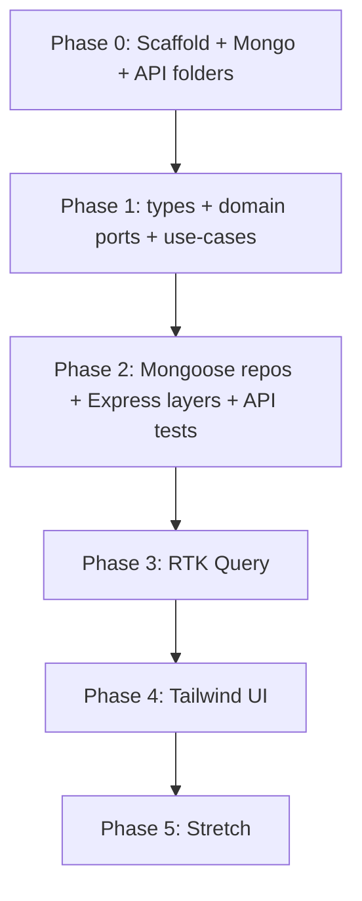

# Event Registration Platform — Tutorial Plan

> **Goal:** Build a full-stack app in an **Nx monorepo** with **React**, **Redux Toolkit + RTK Query**, **Tailwind CSS**, **Express**, and **MongoDB (Mongoose)** — using **common production patterns** (layered API, repositories, application services).
>
> **Business rules only:** [`.cursor/refer/event-system.ts`](./refer/event-system.ts) and [`.cursor/refer/event-system.test.ts`](./refer/event-system.test.ts) define **what** must happen (return codes, validation, FIFO waitlist). They are a **kata spec**, not the architecture to copy. Do **not** port the in-memory `EventSystem` class or `events.push()` storage.
>
> **Specification:** [`.cursor/spec.md`](./spec.md)

---

## Architecture principles (read first)

| Principle | What to do | What to avoid |
|-----------|------------|---------------|
| **Persistence** | MongoDB is the system of record from day one in `apps/api` | Domain `events[]` / `participants[]` arrays as app state |
| **Layering** | Routes → controllers → **application services** → **repositories** → Mongoose | Fat route handlers with business rules + DB calls mixed together |
| **Domain (`libs/domain`)** | Pure rules + use-cases; depends on **repository interfaces (ports)** only | Importing Mongoose, Express, or `apps/*` in domain |
| **Reference kata** | Trace rules and port **scenarios** to tests | Copying `EventSystem` structure or `Date.now()` IDs in production |
| **API contract** | Keep `{ result: 1 \| 0 \| -1, data?, error? }` for mutating ops (matches kata UX) | Throwing for expected business failures (`result: -1`) |
| **IDs** | `ObjectId` (or UUID) in DB; string IDs in JSON | `Date.now().toString()` for entity IDs |

```text
apps/api/
  routes/          → HTTP paths, no business logic
  controllers/     → parse request, call service, map to HTTP status
  services/        → orchestrate use-cases (transactions, call domain + repos)
  repositories/    → Mongoose queries (implement domain ports)
  models/          → schemas + indexes
  middleware/      → validation (Zod), error handler, CORS, logging

libs/domain/
  validators/      → validateType, validateSkill, validateEmail (from refer)
  use-cases/       → createEvent, createParticipant, register, cancel
  ports/           → EventRepository, ParticipantRepository, WaitlistRepository
```

---

## What you will learn

| Area | Skills |
|------|--------|
| **Nx** | Generate apps/libs, share types, run affected tests, wire project graph |
| **React** | Container/presentational split, forms, result-code feedback |
| **Redux** | Slices, selectors, devtools |
| **RTK Query** | API slices, cache tags, invalidation, loading/error states |
| **Express** | Layered REST API, validation middleware, structured errors |
| **MongoDB** | Schemas, indexes, transactions for register/cancel |
| **Mongoose** | Models, repositories, test DB / memory server |
| **Domain design** | Ports & adapters, use-cases, test doubles (not in-memory “app DB”) |
| **Tailwind** | Layout, responsive admin UI, accessible forms |

---

## Domain overview (from reference — rules only)

Read [`.cursor/refer/event-system.ts`](./refer/event-system.ts) once to understand **rules**, not **structure**.

### Return codes (every mutating operation)

| Code | Meaning | HTTP (recommended) |
|------|---------|-------------------|
| `1` | Success | `200` / `201` |
| `0` | Waitlisted (registration only) | `200` |
| `-1` | Validation / not found / business rule failure | `400` or `404` |

All mutating API responses: `{ result: 1 | 0 | -1, data?: T, error?: string }`.

### Core entities (persisted in MongoDB)

```ts
type Skill = "BEGINNER" | "INTERMEDIATE" | "ADVANCED";
type EventType = "WORKSHOP" | "WEBINAR" | "CONFERENCE";
```

| Entity | Key fields | Notes |
|--------|------------|-------|
| **Event** | `id`, `type`, `capacity`, `skill?`, `participantIds[]` | WORKSHOP requires `skill`; registrations embedded or separate collection |
| **Participant** | `id`, `email`, `skill?` | Unique index on `email` |
| **WaitlistEntry** | `eventId`, `participantId`, `createdAt` | FIFO: `createdAt` ascending |

### Business rules cheat sheet

Same semantics as the reference methods — implement in **validators + use-cases**, persist via **repositories**:

**Create event** — invalid type, `capacity <= 0`, WORKSHOP skill rules → `-1`; else insert via `EventRepository` → `1`.

**Create participant** — missing/invalid email or skill → `-1`; else insert → `1`.

**Register** — unknown ids, duplicate, waitlist duplicate, CONFERENCE email, WORKSHOP skill mismatch → `-1`; at capacity → insert waitlist → `0`; else add to `participantIds` → `1`.

**Cancel** — unknown / not registered → `-1`; waitlist only → delete waitlist row → `1`; registered → remove + promote first waitlist (same rules as register) → `1`.

---

## Target workspace layout

```
event-platform/
├── apps/
│   ├── web/                      # React + Redux + RTK Query + Tailwind
│   └── api/
│       └── src/
│           ├── main.ts
│           ├── app.ts
│           ├── config/
│           ├── routes/
│           ├── controllers/
│           ├── services/         # application / use-case orchestration
│           ├── repositories/     # Mongoose implementations of domain ports
│           ├── models/
│           └── middleware/
├── libs/
│   ├── shared-types/             # DTOs, enums, ApiResponse, request bodies
│   ├── domain/                   # validators, use-cases, repository ports
│   └── ui/                       # optional shared components
├── docker-compose.yml
└── .env.example
```

**Project boundaries:**

- `libs/shared-types` — no imports from `apps/*`.
- `libs/domain` — no Mongoose, Express, or `apps/*`; only ports + pure logic.
- `apps/api` — wires Mongoose repos, Express, and domain use-cases.
- UI never encodes business rules; server enforces everything.

---

## Phase 0 — Scaffold the Nx workspace

**Time estimate:** 1–2 hours

### Step 0.1 — Create the monorepo

```bash
npx create-nx-workspace@latest event-platform --preset=apps
npx nx add @nx/react
npx nx add @nx/node
npx nx g @nx/react:app web --bundler=vite
npx nx g @nx/node:application api
npx nx g @nx/js:lib shared-types
npx nx g @nx/js:lib domain
```

Use **`npx nx`**, not bare `nx`.

#### Generator: “Would you like to add routing?” → **Yes**

| Screen | Route | Scope |
|--------|-------|--------|
| **Events** | `/events` | CRUD events |
| **Participants** | `/participants` | CRUD participants |
| **Registrations** | `/registrations` | Register, cancel, waitlist |

### Step 0.2 — Start MongoDB locally

`docker-compose.yml` with `mongo:7` on `27017`. `.env.example`:

```env
MONGODB_URI=mongodb://localhost:27017/event-platform
PORT=3333
CORS_ORIGIN=http://localhost:4200
```

```bash
docker compose up -d
```

### Step 0.3 — Add Tailwind to `apps/web`

Verify `nx serve web` renders a styled page.

### Step 0.4 — Scaffold API folder structure

Under `apps/api/src`, create empty folders: `routes`, `controllers`, `services`, `repositories`, `models`, `middleware`, `config`. Export a minimal `app.ts` + `main.ts` that connects to Mongo on boot.

**Checkpoint:** `nx serve web` and `nx serve api` start; MongoDB container is running.

---

## Phase 1 — Shared types and domain (ports + use-cases)

**Time estimate:** 2–3 hours

Domain is **pure logic**. Storage is **always** behind repository interfaces.

### Step 1.1 — Define shared types in `libs/shared-types`

```ts
export type Skill = "BEGINNER" | "INTERMEDIATE" | "ADVANCED";
export type EventType = "WORKSHOP" | "WEBINAR" | "CONFERENCE";
export type ResultCode = 1 | 0 | -1;

export interface EventDto { id: string; type: EventType; capacity: number; skill?: Skill; participantIds: string[]; }
export interface ParticipantDto { id: string; email: string; skill?: Skill; }
export interface WaitlistEntryDto { eventId: string; participantId: string; createdAt: string; }

export interface CreateEventRequest { type: EventType; capacity: number; skill?: Skill; }
export interface CreateParticipantRequest { email: string; skill?: Skill; }
export interface RegisterRequest { participantId: string; }

export interface ApiResponse<T = unknown> {
  result: ResultCode;
  data?: T;
  error?: string;
}
```

Configure `tsconfig.base.json` paths: `@event-platform/shared-types`, `@event-platform/domain`.

### Step 1.2 — Domain validators (from reference, not the class)

In `libs/domain`, extract **only** the rule functions from the kata:

- `validateEventType(type: string): boolean`
- `validateEventSkill(type: EventType, skill?: string): boolean`
- `validateParticipantSkill(skill?: string): boolean`
- `validateConferenceEmail(email: string): boolean`

Mirror the reference’s `validateType`, `validateSkill`, `validateEmail` behavior exactly.

### Step 1.3 — Repository ports (interfaces)

In `libs/domain/ports/`:

```ts
export interface EventRepository {
  findById(id: string): Promise<EventDto | null>;
  create(data: Omit<EventDto, "id" | "participantIds">): Promise<EventDto>;
  addParticipant(eventId: string, participantId: string): Promise<void>;
  removeParticipant(eventId: string, participantId: string): Promise<void>;
  countParticipants(eventId: string): Promise<number>;
}

export interface ParticipantRepository {
  findById(id: string): Promise<ParticipantDto | null>;
  create(data: Omit<ParticipantDto, "id">): Promise<ParticipantDto>;
}

export interface WaitlistRepository {
  findEntry(eventId: string, participantId: string): Promise<WaitlistEntryDto | null>;
  add(entry: Omit<WaitlistEntryDto, "createdAt">): Promise<WaitlistEntryDto>;
  remove(eventId: string, participantId: string): Promise<void>;
  getFirstForEvent(eventId: string): Promise<WaitlistEntryDto | null>;
  listForEvent(eventId: string): Promise<WaitlistEntryDto[]>;
}
```

Adjust method names to your taste; keep responsibilities clear and persistence-agnostic.

### Step 1.4 — Use-cases (application logic without storage)

In `libs/domain/use-cases/` implement functions that take **ports** and return `Promise<{ result: ResultCode; data?: T; error?: string }>`:

| Use-case | Validates (refer rules) | Persists via |
|----------|-------------------------|--------------|
| `createEvent` | type, capacity, skill | `EventRepository.create` |
| `createParticipant` | email, skill | `ParticipantRepository.create` |
| `registerParticipant` | existence, duplicates, CONFERENCE/WORKSHOP rules, capacity | `EventRepository` + `WaitlistRepository` |
| `cancelRegistration` | existence; waitlist vs registered; FIFO promotion | repos + re-use register rules for promote |

**No in-memory arrays** in use-cases. If validation fails before any write, return `{ result: -1 }` without touching the DB.

### Step 1.5 — Domain unit tests (mocked repositories)

Port **scenarios** from [`.cursor/refer/event-system.test.ts`](./refer/event-system.test.ts):

- Implement **in-memory fake repositories** in `domain/src/testing/` (test-only doubles — standard practice).
- Call use-cases with fakes; assert `result` codes and repository side effects.

```bash
npx nx test domain
```

**Checkpoint:** All domain tests green. `libs/domain` has zero imports from `apps/*`, Mongoose, or Express.

---

## Phase 2 — Express API + Mongoose (production wiring)

**Time estimate:** 4–6 hours

Persistence lives in `apps/api`. Handlers stay thin.

### Step 2.1 — Mongoose models

| Model | Indexes |
|-------|---------|
| `Event` | — |
| `Participant` | unique `{ email: 1 }` |
| `WaitlistEntry` | compound `{ eventId: 1, createdAt: 1 }` |

Use `ObjectId`; map to string `id` in DTOs.

### Step 2.2 — Repository implementations

`apps/api/src/repositories/*.ts` implements domain ports with Mongoose. No business branching here — only CRUD and queries.

### Step 2.3 — Application services

`apps/api/src/services/*.ts`:

- Inject concrete repositories (constructor or factory).
- Call domain use-cases; map domain results to `ApiResponse`.
- Use **MongoDB transactions** for `registerParticipant` / `cancelRegistration` when multiple collections change (stretch: document in code comments first, add transaction in Step 2.3 or Phase 5).

### Step 2.4 — Controllers and routes

| Layer | Responsibility |
|-------|----------------|
| **Routes** | Mount paths under `/api/v1`, attach validation middleware |
| **Controllers** | `req` → service call → `res.status().json()` |
| **Middleware** | Zod schemas from `shared-types`; centralized `errorHandler`; CORS; request logging |

| Method | Path | Service / use-case |
|--------|------|-------------------|
| `POST` | `/events` | `createEvent` |
| `GET` | `/events` | list (repository or thin query service) |
| `GET` | `/events/:id` | get by id |
| `POST` | `/participants` | `createParticipant` |
| `GET` | `/participants` | list |
| `POST` | `/events/:eventId/registrations` | `registerParticipant` |
| `DELETE` | `/events/:eventId/registrations/:participantId` | `cancelRegistration` |
| `GET` | `/events/:eventId/waitlist` | ordered waitlist |

**HTTP mapping:**

| `result` | HTTP | Body |
|----------|------|------|
| `1` | `200` / `201` | `{ result: 1, data?: T }` |
| `0` | `200` | `{ result: 0, data?: T }` |
| `-1` | `400` or `404` | `{ result: -1, error?: string }` |

### Step 2.5 — API integration tests

Port every **scenario** from [`.cursor/refer/event-system.test.ts`](./refer/event-system.test.ts) to **Supertest + real test database** (e.g. `mongodb-memory-server` or Docker test DB):

- Hit HTTP endpoints; assert status + `result` + DB state (documents exist / absent, waitlist order).
- No fake timers for IDs — use real ObjectIds.

```bash
npx nx test api
```

**Checkpoint:** All API integration tests pass. Business rules enforced only in domain use-cases; Express never duplicates refer logic.

---

## Phase 3 — Redux + RTK Query

**Time estimate:** 3–4 hours

### Step 3.1 — Redux store

`ui` slice only for local UI state. Server data in RTK Query cache.

### Step 3.2 — `eventApi` slice

| Endpoint | Type | Cache tags |
|----------|------|------------|
| `getEvents` | query | `Event` |
| `getEventById` | query | `Event`, id |
| `createEvent` | mutation | invalidates `Event` |
| `getParticipants` | query | `Participant` |
| `createParticipant` | mutation | invalidates `Participant` |
| `registerForEvent` | mutation | invalidates `Event`, `Waitlist` |
| `cancelRegistration` | mutation | invalidates `Event`, `Waitlist` |
| `getWaitlist` | query | `Waitlist`, eventId |

Handle `result: -1` in UI without treating it as a transport error.

### Step 3.3 — Wire pages to hooks

**Checkpoint:** Full flows work against live API + MongoDB.

---

## Phase 4 — React UI with Tailwind

**Time estimate:** 3–5 hours

Three route-backed screens: `/events`, `/participants`, `/registrations`.

- Show `result` `1` / `0` / `-1` feedback (green / yellow waitlist / red error).
- CONFERENCE domain helper text; WORKSHOP participant filter (server still enforces).

**Checkpoint:** create → register → waitlist → cancel → promote visible in UI.

---

## Phase 5 — Stretch goals

| Goal | Notes |
|------|-------|
| **Transactions** | Register/cancel with multi-document atomicity |
| **JWT auth** | Protect admin routes |
| **OpenAPI** | Generate from Zod |
| **E2E** | Playwright on critical flows |
| **Optimistic updates** | RTK Query `onQueryStarted` |

---

## Acceptance checklist

- [ ] Nx serves `web` and `api`; MongoDB persists all entities
- [ ] API uses routes → controllers → services → repositories (no fat handlers)
- [ ] Domain has use-cases + ports; **no** kata-style in-memory `EventSystem` in production code
- [ ] All refer scenarios pass as **domain tests (mock repos)** and **API tests (HTTP + DB)**
- [ ] Business rules match [`.cursor/refer/`](./refer/); architecture matches this plan
- [ ] RTK Query + Tailwind UI with clear `1` / `0` / `-1` feedback

---

## Commands cheat sheet

```bash
docker compose up -d
npx nx serve api
npx nx serve web
npx nx test domain    # use-cases + fake repos
npx nx test api       # Supertest + Mongo
npx nx test web
npx nx affected -t test
```

---

## Suggested study order



1. Read [`.cursor/refer/event-system.test.ts`](./refer/event-system.test.ts) as an **acceptance checklist** (rules + `result` codes).
2. Implement **validators + use-cases + ports** in Phase 1 (test with fake repos).
3. Wire **Mongoose + Express** in Phase 2; prove rules over HTTP.
4. Frontend Phases 3–4.

---

## References

| File | Role |
|------|------|
| [`.cursor/refer/event-system.ts`](./refer/event-system.ts) | **Business rules reference** (read-only kata) |
| [`.cursor/refer/event-system.test.ts`](./refer/event-system.test.ts) | **Acceptance scenarios** to port to domain + API tests |
| [`.cursor/spec.md`](./spec.md) | NFRs and API surface |
| [`.cursor/plan.md`](./plan.md) | This tutorial plan |

**Rule disputes:** match the reference behavior. **Architecture disputes:** match this plan (layered API, repositories, no in-memory app database).
